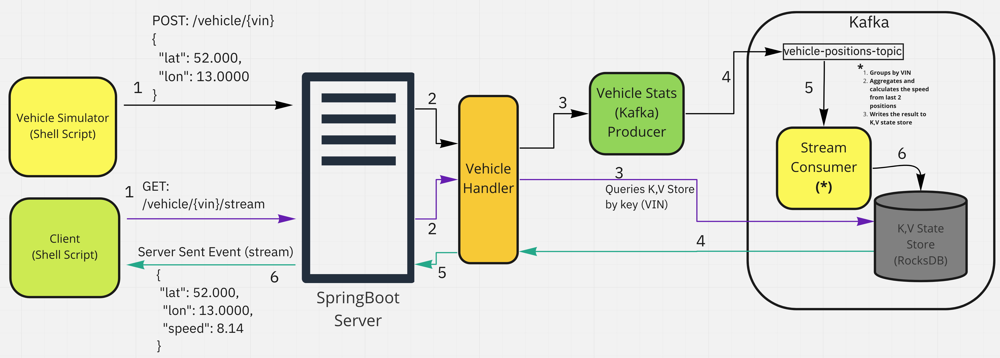
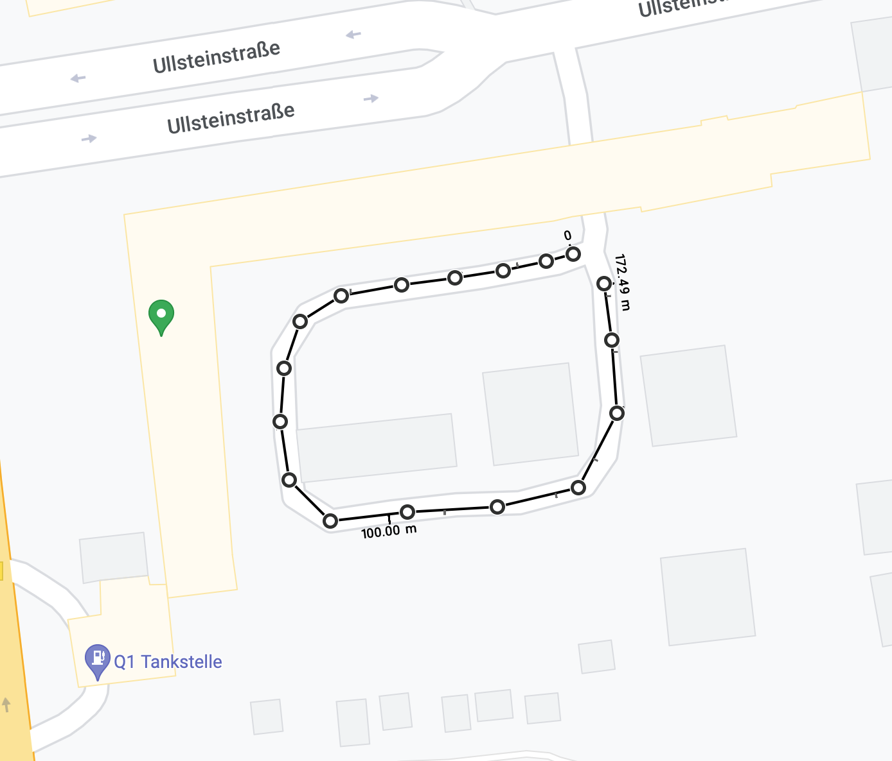

# SpringBoot Kotlin Kafka Streams Demo

This very simple project implements a simple API that consumes GPS coordinates from vehicles. 
It processes the incoming data using a Kafka Streams Processor (consumer), and exposes
a streaming (Server Sent Event) endpoint to view a vehicle's live coordinates with calculated speed.


### Base Stack
- Docker, docker-compose
- Kotlin 1.3
- SpringBoot 2.3.4, with Webflux and Reactor for nonblocking requests
- Kafka 3.0 (Streams), Zookeeper, Schema Registry, Avro
- Maven 3.6

### Architecture


#### Why Kafka and why Kafka Streams?
Kafka coupled with Kafka Streams provide excellent throughput performance
for this type of real time ingestion/transformation/aggregation of data.
It provides a convenient DSL for these operations, as well as 
reprocessing capabilities, plus it's distributed, highly scalable

### How to run

We need to start Kafka, Schema Registry, Zookeeper, and our SpringBoot app.
On the project's root folder, run:

```bash
$ docker-compose up
```

Look at the console to see when SpringBoot, Kafka, and Schema Registry become ready: 

```bash
server_1           | [...]  INFO 1 --- [-StreamThread-1] org.apache.kafka.streams.KafkaStreams    : stream-client [...] State transition from REBALANCING to RUNNING
schema-registry    | [...] INFO Started @14965ms (org.eclipse.jetty.server.Server)
schema-registry    | [...] INFO Schema Registry version: 7.0.1 commitId: 18606ae284c9b81c006a6560d8141ef80eb27c89 (io.confluent.kafka.schemaregistry.rest.SchemaRegistryMain)
schema-registry    | [...] INFO Server started, listening for requests... (io.confluent.kafka.schemaregistry.rest.SchemaRegistryMain)
```

### Vehicle Simulator
Once the server is running, we can use `vehicle_simulator.sh` to simulate a fleet going around a set of predefined coordinates
found in `around_the_block_gps_coordinates.txt`. 
This simple script is able to simulate a couple of hundred vehicles posting their position
in parallel, every second, by making use of `xargs`'s `-P` option for parallelism.
For simplicity, every vehicle starts at the same position.

Script options: 

n -> number of vehicles

r -> update interval

Example:
```bash
$ ./vehicle_simulator.sh -n10 -r1
Number of vehicles: 10
Rate (POSTs/sec): 1

--0----------------------------------------------------------------------------
Vehicle Number: 1        lat: 52.452505904239300         lon: 13.386259069173880
Vehicle Number: 2        lat: 52.452505904239300         lon: 13.386259069173880
Vehicle Number: 10       lat: 52.452505904239300         lon: 13.386259069173880
Vehicle Number: 3        lat: 52.452505904239300         lon: 13.386259069173880
Vehicle Number: 4        lat: 52.452505904239300         lon: 13.386259069173880
Vehicle Number: 5        lat: 52.452505904239300         lon: 13.386259069173880
Vehicle Number: 8        lat: 52.452505904239300         lon: 13.386259069173880
Vehicle Number: 6        lat: 52.452505904239300         lon: 13.386259069173880
Vehicle Number: 9        lat: 52.452505904239300         lon: 13.386259069173880
Vehicle Number: 7        lat: 52.452505904239300         lon: 13.386259069173880
--1----------------------------------------------------------------------------
Vehicle Number: 1        lat: 52.452497685439471         lon: 13.386181523013991
Vehicle Number: 3        lat: 52.452497685439471         lon: 13.386181523013991
Vehicle Number: 2        lat: 52.452497685439471         lon: 13.386181523013991
Vehicle Number: 5        lat: 52.452497685439471         lon: 13.386181523013991
Vehicle Number: 4        lat: 52.452497685439471         lon: 13.386181523013991
Vehicle Number: 7        lat: 52.452497685439471         lon: 13.386181523013991
Vehicle Number: 6        lat: 52.452497685439471         lon: 13.386181523013991
Vehicle Number: 8        lat: 52.452497685439471         lon: 13.386181523013991
Vehicle Number: 9        lat: 52.452497685439471         lon: 13.386181523013991
Vehicle Number: 10       lat: 52.452497685439471         lon: 13.386181523013991

...
```

SpringBoot logs the calculated speed for each vehicle for debugging purposes, ex:

```bash
server_1 | 19:45:27.132  INFO 1 StreamConsumer: Vehicle Stats - vin: 1, lat: 52.45249768543947, lon: 13.386181523013992, speed: 19.199002022353554
server_1 | 19:45:27.188  INFO 1 StreamConsumer: Vehicle Stats - vin: 4, lat: 52.45249768543947, lon: 13.386181523013992, speed: 19.199002022353554
server_1 | 19:45:27.191  INFO 1 StreamConsumer: Vehicle Stats - vin: 5, lat: 52.45249768543947, lon: 13.386181523013992, speed: 19.199002022353554
server_1 | 19:45:27.207  INFO 1 StreamConsumer: Vehicle Stats - vin: 3, lat: 52.45249768543947, lon: 13.386181523013992, speed: 19.199002022353554
server_1 | 19:45:27.208  INFO 1 StreamConsumer: Vehicle Stats - vin: 2, lat: 52.45249768543947, lon: 13.386181523013992, speed: 19.199002022353554
server_1 | 19:45:27.218  INFO 1 StreamConsumer: Vehicle Stats - vin: 6, lat: 52.45249768543947, lon: 13.386181523013992, speed: 19.199002022353554
server_1 | 19:45:27.220  INFO 1 StreamConsumer: Vehicle Stats - vin: 10, lat: 52.45249768543947, lon: 13.386181523013992, speed: 19.199002022353554
server_1 | 19:45:27.239  INFO 1 StreamConsumer: Vehicle Stats - vin: 9, lat: 52.45249768543947, lon: 13.386181523013992, speed: 19.199002022353554
server_1 | 19:45:27.242  INFO 1 StreamConsumer: Vehicle Stats - vin: 7, lat: 52.45249768543947, lon: 13.386181523013992, speed: 19.199002022353554
server_1 | 19:45:27.265  INFO 1 StreamConsumer: Vehicle Stats - vin: 8, lat: 52.45249768543947, lon: 13.386181523013992, speed: 19.199002022353554
server_1 | 19:45:28.397  INFO 1 StreamConsumer: Vehicle Stats - vin: 1, lat: 52.45248124783526, lon: 13.386073632704582, speed: 27.129972685131754
server_1 | 19:45:28.422  INFO 1 StreamConsumer: Vehicle Stats - vin: 3, lat: 52.45248124783526, lon: 13.386073632704582, speed: 27.129972685131754
server_1 | 19:45:28.427  INFO 1 StreamConsumer: Vehicle Stats - vin: 4, lat: 52.45248124783526, lon: 13.386073632704582, speed: 27.129972685131754
server_1 | 19:45:28.438  INFO 1 StreamConsumer: Vehicle Stats - vin: 5, lat: 52.45248124783526, lon: 13.386073632704582, speed: 27.129972685131754
server_1 | 19:45:28.442  INFO 1 StreamConsumer: Vehicle Stats - vin: 7, lat: 52.45248124783526, lon: 13.386073632704582, speed: 27.129972685131754
server_1 | 19:45:28.470  INFO 1 StreamConsumer: Vehicle Stats - vin: 6, lat: 52.45248124783526, lon: 13.386073632704582, speed: 27.129972685131754
server_1 | 19:45:28.491  INFO 1 StreamConsumer: Vehicle Stats - vin: 8, lat: 52.45248124783526, lon: 13.386073632704582, speed: 27.129972685131754
server_1 | 19:45:28.498  INFO 1 StreamConsumer: Vehicle Stats - vin: 10, lat: 52.45248124783526, lon: 13.386073632704582, speed: 27.129972685131754
server_1 | 19:45:28.505  INFO 1 StreamConsumer: Vehicle Stats - vin: 2, lat: 52.45248124783526, lon: 13.386073632704582, speed: 27.129972685131754
server_1 | 19:45:28.509  INFO 1 StreamConsumer: Vehicle Stats - vin: 9, lat: 52.45248124783526, lon: 13.386073632704582, speed: 27.129972685131754
```

### Client to view stats/speed of a specific vehicle
There's a shell script that does a CURL GET request, accepting event-stream.
It takes an option `-v<vin>`, ex.:

```bash
victorchiu ~/kotlin-demo $ ./vehicle_stats.sh -v1
Streaming stats for vehicle: 1

data:{"vin":"1","lat":52.45249768543947,"lon":13.386181523013992,"speed":19.199002022353554}
data:{"vin":"1","lat":52.45248124783526,"lon":13.386073632704582,"speed":27.129972685131754}
...
```

### Testing / Verifying the calculated speeds are correct AND in the correct order:
I first calculated the distance between each successive coordinate found in the file `around_the_block_gps_coordinates.txt`
using the "Haversine" formula and derived the speed by multiplying by (60 * 60)
since every vehicle is sending its position every second.

The list of expected speeds should cycle in the following order:

```bash
0.0053337371638516005 * 3600 = 19.201453789865763 (km/s)
0.007536122155897309 * 3600 = 27.130039761230314 (km/s)
0.008530313638711696 * 3600 = 30.709129099362105 (km/s)
0.009663598639425322 * 3600 = 34.78895510193116 (km/s)
0.01030914749963688 * 3600 = 37.11293099869277 (km/s)
0.00930026704123794 * 3600 = 33.48096134845658 (km/s)
0.008453497964615427 * 3600 = 30.432592672615534 (km/s)
0.010283838836268433 * 3600 = 37.021819810566356 (km/s)
0.00943682552913296 * 3600 = 33.972571904878656 (km/s)
0.011308896060898164 * 3600 = 40.71202581923339 (km/s)
0.013410100575082667 * 3600 = 48.2763620702976 (km/s)
0.015779618142863074 * 3600 = 56.80662531430707 (km/s)
0.015144926322695413 * 3600 = 54.521734761703485 (km/s)
0.01512765777618811 * 3600 = 54.459567994277194 (km/s)
0.012584705182288665 * 3600 = 45.304938656239194 (km/s)
0.010404916999457677 * 3600 = 37.45770119804764 (km/s)
0.0072717388825253955 * 3600 = 26.178259977091425 (km/s)
```

### Streaming the status of a vehicle going once around the map below yields the correct speeds:
```bash
$ ./vehicle_stats.sh -v1
Streaming stats for vehicle: 1

data:{"vin":"1","lat":52.45249768543947,"lon":13.386181523013992,"speed":19.199002022353554}
data:{"vin":"1","lat":52.45248124783526,"lon":13.386073632704582,"speed":27.129972685131754}
data:{"vin":"1","lat":52.452470974329515,"lon":13.385948884534322,"speed":30.70631022914828}
data:{"vin":"1","lat":52.45246070082138,"lon":13.385807278503224,"speed":34.786520744665424}
data:{"vin":"1","lat":52.45244015379789,"lon":13.385658929327786,"speed":37.11110555452755}
data:{"vin":"1","lat":52.45240111442685,"lon":13.385537552729696,"speed":33.47767405967676}
data:{"vin":"1","lat":52.452329199705396,"lon":13.385497093863666,"speed":30.429301115935218}
data:{"vin":"1","lat":52.452236737748116,"lon":13.385493722291498,"speed":37.019725915861514}
data:{"vin":"1","lat":52.45215249446248,"lon":13.38551058015235,"speed":33.96945892661823}
data:{"vin":"1","lat":52.45208057933503,"lon":13.38562858517826,"speed":40.708589176097895}
data:{"vin":"1","lat":52.45209907180759,"lon":13.385824136364072,"speed":48.274108072550995}
data:{"vin":"1","lat":52.452105235963394,"lon":13.386056774843741,"speed":56.804779811767915}
data:{"vin":"1","lat":52.452255230155096,"lon":13.386370331055463,"speed":54.456541965477385}
data:{"vin":"1","lat":52.45236823914018,"lon":13.386360216338964,"speed":45.30235243374892}
data:{"vin":"1","lat":52.45246070082138,"lon":13.386336615333777,"speed":37.45569145749586}
data:{"vin":"1","lat":52.4525059042393,"lon":13.38625906917388,"speed":26.17689923277163}
data:{"vin":"1","lat":52.45249768543947,"lon":13.386181523013992,"speed":19.199002022353554}
```



## Next steps
The execution of this exercise was timed-boxed to around 6 hours during a train ride between German cities.
There are integration tests still to be written that would test the Kafka Streams Consumer more properly.

The incoming position data can be persisted in another type of DB for further processing / data science, etc.

The aggregation in the Kafka Streams Consumer could use a Windowed function to smooth out the speed readings.

The current architecture with reactive, non-blocking requests to SpringBoot and Kafka Streams backed by RocksDB
as state store is able to handle a ton of writes (RocksDB is optimized for writes, it's used by Cassandra for ex.),
while still having great reads performance. 
In order to scale the current architecture to support 200k+ vehicles and 20+ cities,
we would need to have multiple instances of the server running, tweak the number of partitions, etc.

A better load tester (JMeter, Gatling, Apache AB) to make sure the system can handle 200k+ req/s


